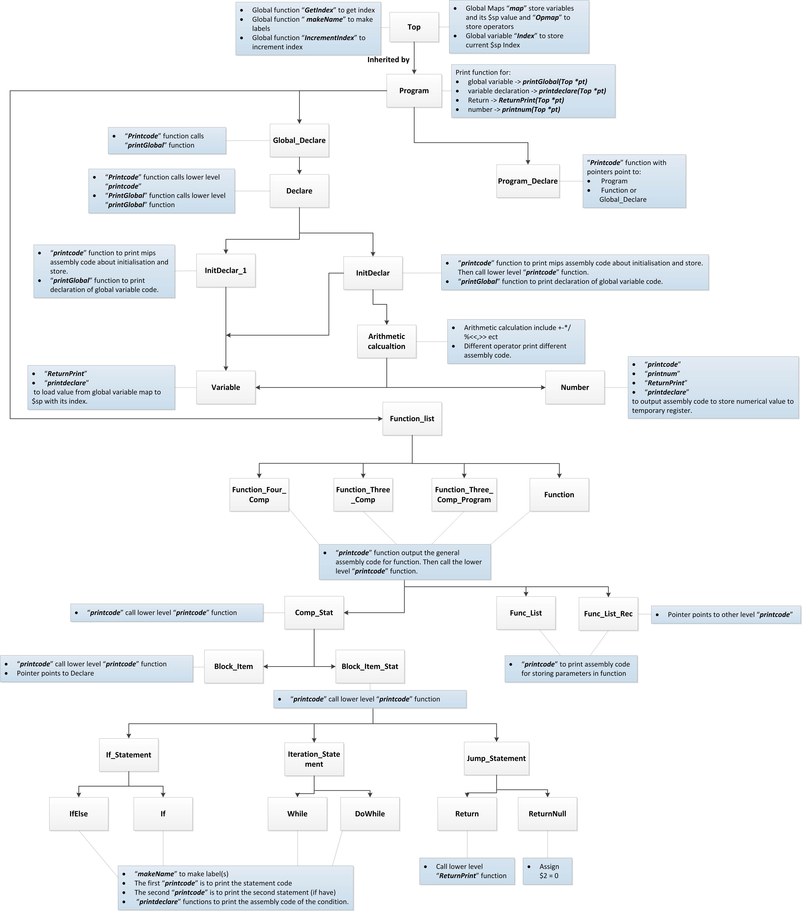

Documentation
=============

In total the documentation burden is (at most) 1000 words
plus one diagram. Assesment of the documentation is not relative
to compiler functionality, it just requires a description
of the compiler as-is, and a realistic assessment of the
compiler's strengths and weaknesses.

AST
===

Overview Diagram
----------------

Description
-----------

My AST is based on the C89/C90 parser. The most important thing for my ast is that the top-level AST is a class called "Top". Which has a map to store the variable and its current stack pointer $2 index; another map to store the opcode; a "makeName" function that is inherited from the code-gen lab to generate labels for the functions like If(IfElse), Iteration. There is a Getter function to get the index of the stack pointer. And an Increment function to increment index by 4. The way to access those global functions and maps is using pointer points to them. Hence, my print function used to print the assembly code all passing a pointer. So that in my lower level AST, I can access and rewrite them easily. Also, the AST can be shared with different rules in the parser with similar functionalities.

Strengths
---------

_Give two strengths or capabilities of your AST, using 50 words or less for each one_.

### Strength 1

The AST is reusable when there are similar functionalities applied. It is more efficiency than generating the same type of node with different names. For example, the class called "Expr" is used several times because it only needs to call the lower level print-code function.

### Strength 2

I use different print functions to print the MIPS assembly code. This is because the output for the Return and Declaration are not the same, so different print functions will be more manageable and easier to understand.

Limitations
-----------

_Give two limitations of your AST, using 50 words or less for each one_.

### Limitation 1

Although there are some classes in the AST can be reused, there are still some redundant parts to be eliminated due to similar functionality.

### Limitation 2

It will get rather cumbersome to edit when I want to add nodes. As I need to go through the complicated AST in order to trace the entry point to edit the tree.

Variable binding
================

General approach
----------------

In my compiler, I create a global map to store the variable and parameters. It is a map that can store the name of the variable/parameter and its current stack pointer location(Index). So every time we define a variable or meet a parameter, the "printcode" function in "InitDeclar" will use get the current stack pointer Index and the name of the Variable/Parameter and store them into the global map. When it is used, the name of the variable is extracted again and used to search through the map to get the Index, then the code "lw" will be used to load the value from the stack pointer to the register.

The most often used registers are temporary registers. I will load/store the variable/parameter to the temporary register and do the operation. At the end of the operation such as return, I will move the value from temporary register back to $2.

Strengths
---------

_Give two strengths or capabilities of your binding approach, using 50 words or less for each one_.

### Strength 1

The map called "map" to store the variable/parameter name and Index is easy to call and use. As I define them in the Top class with global properties. So the map can be used in anywhere and modify by my pointer in the function in my AST.

### Strength 2

I also create a map called "Opmap" to store the label name that represents the operand and the current stack pointer index of it. So when I meet an operator, I can easily handle the assembly code output.

Limitations
-----------

_Give two limitations of your binding approach, using 50 words or less for each one_.

### Limitation 1

The map can only store the variable/parameter name and its stack pointer location. But cannot store the value of the variable/parameter. So I use memory/stack to store the variable instead of using the registers. It will reduce the efficiency.

### Limitation 2

The two map "map" and "Opmap" are kind of redundant, because they are used to store the variable name, operand name, and the current stack pointer value. It can be eliminated by created a two-dimensional map.

Reflection
==========

Strengths
---------

_What two aspects of your compiler do you think work well (beyond
those identified in the AST and binding parts)?_

### Strength 1

I can handle the redeclare variable by searching the variable map and get to stack pointer value back, then load it into a register.

### Strength 2

My compiler's grammar follows C89 documentation, so there will be few grammar errors in my compiler.

Scope for Improvement
---------------------

_What parts of your compiler do you think could be improved?_

- _This is not looking for things like "It should support more C constructs". What
  would you need to do or change in order to support those things?_

### Improvement 1
The AST can be eliminated to a smaller size. As there are too some redundant parts in the tree. So I need to change my AST to be reusable when it meet some grammar with similar functionality.

### Improvement 2

My compiler generates some redundant codes, such as load the stack pointer to a register and stores it back to another one. Those codes should be eliminated in order to increase the efficiency of my assembly code.

Functionality (not assessed)
============================

Which of these features does your compiler support (insert
an `x` to check a box):

1 - [x] Local variables
2 - [x] Integer arithmetic
3 - [x] While
4 - [x] IfElse
5 - [ ] For
6 - [ ] Function calls
7 - [ ] Arrays
8 - [ ] Pointers
9 - [ ] Strings
10 - [ ] Structures
11 - [ ] Floating-point

Note that all features will be tested, regardless of what
appears here. This is documentation of what you expect to work,
versus what doesn't work.

Feedback (not assessed)
=======================

_What aspects of your compiler would you like feedback on.
Be specific, as "what could I have done differently" is
too general to answer._

### Feedback 1

Is there any better way to reduce the number of print functions in my ast, I use several print functions for declare, return, increment ect.

### Feedback 2

_20 words or fewer_

